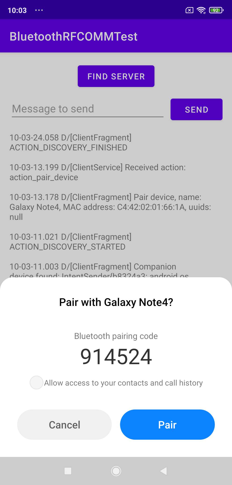

# Android Bluetooth RFCOMM client

## Pairing with CompanionDeviceManager
### Documents
[Companion device pairing](https://developer.android.com/guide/topics/connectivity/companion-device-pairing)

### Requirements

* Devices running Android 8.0 (API level 26) and higher
* Enabling bluetooth before use CompanionDeviceManager

### Permissions

```
<!-- For requesting enabling bluetooth -->
<uses-permission android:name="android.permission.BLUETOOTH" />

<!-- For companion device pairing -->
<uses-feature android:name="android.software.companion_device_setup" />

<!-- To start the app from the background -->
<uses-permission android:name="android.permission.REQUEST_COMPANION_RUN_IN_BACKGROUND" />
<uses-permission android:name="android.permission.REQUEST_COMPANION_USE_DATA_IN_BACKGROUND" />
```

### How it works
* You **have ever paired**/**is pairing** the target device while the RFCOMM server **was**/**is** opening before (there's a local cache for companion devices).

1. Find the companion device by calling [CompanionDeviceManager#associate()](https://developer.android.com/reference/android/companion/CompanionDeviceManager#associate(android.companion.AssociationRequest,%20android.companion.CompanionDeviceManager.Callback,%20android.os.Handler)) with one or more following attributes.
    * A MAC address.
    * A regex for matching the name.
    * A service UUID with or without a bits mask.
2. The Android system pops up a dialog to comfirm the action.  

3. **(If the companion device is not paired now)** The Android system shows up a dialog to pair the device.  

4. Connect to the received **BluetoothDevice**.

## Discoverying by trandictonal BT APIs
### Documents
[Bluetooth overview](https://developer.android.com/guide/topics/connectivity/bluetooth)

### Requirements


### Permissions
```
<!-- For requesting enabling bluetooth -->
<uses-permission android:name="android.permission.BLUETOOTH" />

<!-- For discovery BT devices -->
<uses-permission android:name="android.permission.BLUETOOTH_ADMIN" />
<uses-permission android:name="android.permission.ACCESS_FINE_LOCATION" />
<uses-permission android:name="android.permission.ACCESS_BACKGROUND_LOCATION" />
```

### How it works
* The ```BluetoothAdapter``` can only execute **one task at a time**.
* You can select the bluetooth devcie by name, MAC address or UUIDs.
* **The UUIDs is not always available** from the discovery task or the UUIDs fetching task.
* Pairing the target device before the following steps is a more stable way to find the device you want.

1. Get then check the bounded devices by ```BluetoothAdapter#getBoudedDevices()```.
2. **If there's a device that matches the UUID then connect it**.  Otherwise start the bluetooth discovery to find other devices by ```BluetoothAdapter#startDiscovery()```.
4. At this time, you will receive bluetooth devices by broadcast ```BluetoothDevice.ACTION_FOUND```, **if anyone contains the UUID, cancel the discovery and connect the bluetooth device**.
3. After the discovery finished (receiving the broadcast ```BluetoothAdapter.ACTION_DISCOVERY_FINISHED```), if none of the discovered devices matches the UUID, fetch the UUIDs of all dicovered devices one by one with ```BluetoothDevice#fetchUuidsWithSdp()```.
4. **If any device's UUID from broadcast ```BluetoothDevice.ACTION_UUID``` that matches the UUID, stop the UUID fetching task and connect the matched device**.